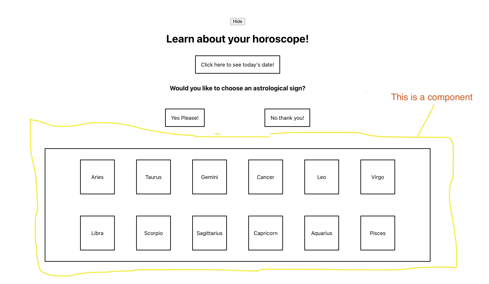
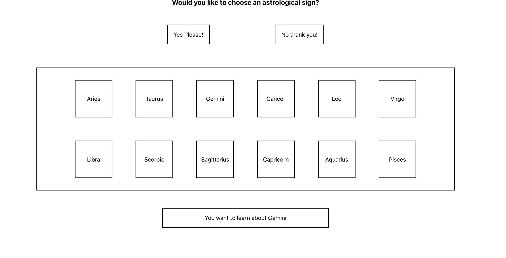
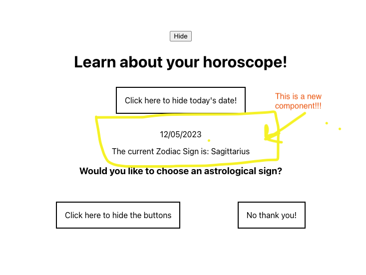

Recreate the UI you see here: https://resonant-mermaid-837089.netlify.app/
1. All dates and astrological sign info must come from the data file. 
   1. In your new React project, create a folder called Data with a file called data.js
   2. Copy + paste the data from the data.js file in this project
2. After the start button is clicked, the UI should look like this:  ](./design-images/after-start-button-click.png)
3. After clicking the 'Yes Please!' button, a new component should render that looks like this: 
   1. Each square is a button.
   2. The text for the buttons must come from the data
   
4. When you click one of the squares, a box should appear at the bottom like so: 
5. When the user clicks the button that asks for today's date, the user should see both the date and the correct sign. 
   1. You must use the start and end dates from the data
   2. The date display will be a new component, like so:
   